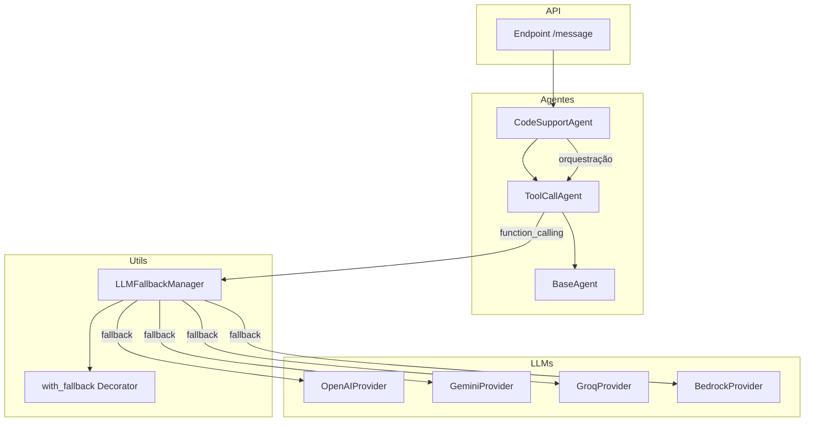

# Relatório Consolidado de Análise do Backend renum-backend-openmanus

## 1. Lógica de Negócio e Orquestração dos Agentes de IA

- A arquitetura dos agentes é modular, com classes base como `BaseAgent` e especializações como `ToolCallAgent`.
- Os agentes gerenciam o ciclo de vida, execução, e integração com ferramentas via function_calling.
- O fallback entre provedores de LLM (OpenAI, Gemini, Groq, Bedrock, etc.) é implementado via `LLMFallbackManager` e decoradores de fallback, garantindo resiliência.
- Os endpoints expõem uma API enxuta que instancia agentes e delega a lógica para eles, mantendo a orquestração encapsulada.

### Diagrama de Alto Nível

---

## 2. Tratamento e Validação do `project_id` para Isolamento Multiempresa

- Não foi encontrada implementação explícita de `project_id` ou equivalente (tenant_id, company_id) no backend.
- O isolamento multiempresa não está implementado nos endpoints, agentes, fluxos ou integração com Supabase.
- O controle de acesso depende exclusivamente do `user_id`, o que não garante isolamento seguro em ambientes multiempresa.
- Recomenda-se implementar passagem e validação explícita de `project_id` e configurar RLS no Supabase.

---

## 3. Integração com Supabase e Aplicação de RLS

- O Supabase é utilizado para operações CRUD em diversas tabelas.
- O único filtro de acesso recorrente é o `user_id`.
- Não há menção ou configuração de políticas de RLS no código ou documentação.
- O isolamento de dados depende do `user_id`, insuficiente para multiempresa.
- Recomenda-se implementar e documentar políticas de RLS para segmentação segura.

---

## 4. Gerenciamento e Segurança das Credenciais de APIs Externas

- Credenciais são armazenadas na tabela `credentials` no Supabase, associadas ao `user_id`.
- As chaves de API são criptografadas antes do armazenamento e descriptografadas no uso.
- O acesso às credenciais é restrito ao usuário autenticado.
- Práticas de segurança incluem criptografia em repouso e controle de acesso.
- Não foram encontradas práticas como rotação automática ou auditoria detalhada, que podem ser melhorias futuras.

---

# Conclusão

O backend apresenta uma arquitetura robusta para orquestração de agentes e fallback de LLMs, porém carece de implementação explícita para isolamento multiempresa e políticas de segurança no banco de dados. O gerenciamento de credenciais segue boas práticas básicas de segurança.

Recomendações principais:
- Implementar isolamento multiempresa via `project_id` e RLS no Supabase.
- Documentar e versionar políticas de segurança e RLS.
- Avaliar melhorias no gerenciamento de credenciais, como rotação e auditoria.
